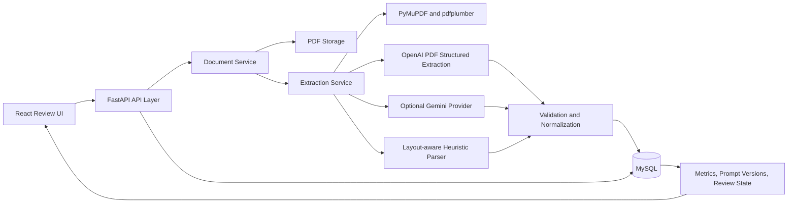

# Architecture Overview

## Summary

The AI Document Intelligence System is designed as a production-style invoice processing pipeline with four main concerns:

1. Ingestion:
   Upload one or many invoice PDFs through the UI or REST API and persist the original source file.

2. Extraction:
   Extract structured invoice data using an LLM-first pipeline with a stronger layout-aware fallback parser.

3. Validation:
   Normalize dates, amounts, currencies, and line items, then compute confidence scores and validation errors.

4. Review and operations:
   Expose extracted data, source PDF preview, prompt versioning, manual correction, reprocessing, deletion, and monitoring through the API and UI.

## High-level flow

1. User uploads invoice PDFs through the React UI or `POST /api/documents`.
2. FastAPI stores the original PDF in `backend/uploads` and creates a document record in MySQL.
3. The extraction service reads the PDF text and layout using PyMuPDF and pdfplumber.
4. The system attempts structured extraction using the active prompt and configured LLM provider.
5. If the LLM path is unavailable, the system falls back to a layout-aware heuristic parser.
6. Extracted fields are normalized and validated.
7. Structured JSON, confidence score, validation errors, prompt version, and processing metadata are stored in MySQL.
8. Operators review the extracted result in the UI, compare it with the original PDF, and optionally correct or reprocess it.

## Diagram

### Plain Text Diagram

```text
+---------------------+
|   React Review UI   |
| Upload / Review /   |
| Prompt Management   |
+----------+----------+
           |
           v
+---------------------+
|   FastAPI API Layer |
| Documents / Metrics |
| Prompts / Reprocess |
+----------+----------+
           |
           v
+---------------------+
|   Document Service  |
| Save file / hash /  |
| fetch / delete      |
+----+-----------+----+
     |           |
     |           v
     |   +----------------------+
     |   |      MySQL DB        |
     |   | documents            |
     |   | extractions          |
     |   | prompt_versions      |
     |   +----------------------+
     |
     v
+---------------------+
|  Extraction Service |
| Active prompt +     |
| extraction routing  |
+----+--------+-------+
     |        | 
     |        +----------------------------+
     |                                     |
     v                                     v
+------------+                   +------------------+
| OpenAI PDF |                   | Gemini / Rules   |
| Structured |                   | Fallback Parsing |
| Extraction |                   +------------------+
+-----+------+                            |
      |                                   |
      +---------------+-------------------+
                      |
                      v
             +----------------------+
             | Validation Layer     |
             | normalize / verify / |
             | confidence scoring   |
             +----------+-----------+
                        |
                        v
             +----------------------+
             | Stored extraction +  |
             | PDF review in UI     |
             +----------------------+
```

### Mermaid Diagram



## Core components

- Frontend:
  React-based responsive operator workspace for upload, queue selection, PDF preview, extracted-field review, prompt management, metrics, reprocessing, and deletion.

- API layer:
  FastAPI endpoints for document ingestion, listing, detail retrieval, PDF streaming, correction, reprocessing, deletion, metrics, and prompt version management.

- Document service:
  Handles file persistence, hash-based deduplication, bulk upload orchestration, retrieval, deletion, and metrics aggregation.

- Extraction service:
  Coordinates text extraction, prompt selection, structured extraction, fallback behavior, and persistence of extraction metadata.

- Prompt service:
  Manages versioned prompt records, activation, editing, and retrieval of the current active prompt.

- Validation layer:
  Normalizes extracted output and validates mathematical consistency, missing fields, and date formatting while producing confidence scores and review signals.

## Storage model

- `documents`
  Stores document identity, filename, file path, status, hash, timestamps, content metadata, and error information.

- `extractions`
  Stores raw extraction metadata, structured JSON output, confidence score, validation errors, missing fields, processing time, prompt version, and manual correction state.

- `prompt_versions`
  Stores versioned LLM prompts and the currently active prompt configuration.

## Production-minded design choices

- MySQL-backed persistence for document and extraction metadata.
- Original PDFs preserved for auditability and human verification.
- Async FastAPI and SQLAlchemy workflow.
- Versioned prompts with explicit activation.
- LLM-first extraction with deterministic fallback for resilience.
- Side-by-side PDF verification in the UI.
- Reprocessing, manual correction, and delete operations for operational control.
- Responsive review interface for desktop and smaller screens.
