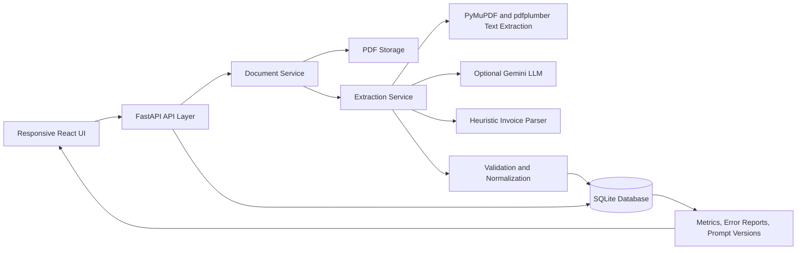

# Architecture Overview

## Summary

The system is organized as a compact production-style pipeline:

1. Upload invoices through the UI or API.
2. Persist the original PDF and document metadata.
3. Extract raw text from the PDF.
4. Run structured extraction through an LLM path when configured, otherwise a deterministic heuristic parser.
5. Normalize and validate the extracted payload.
6. Store structured JSON, confidence score, validation errors, and processing metrics.
7. Expose review, correction, and reprocessing workflows through APIs and the UI.

## Diagram

## Main components

- API layer:
  FastAPI endpoints for upload, list, detail, reprocess, correction, metrics, and prompt management.

- Document service:
  Handles persistence, deduplication by file hash, bulk upload orchestration, and metrics aggregation.

- Extraction service:
  Runs PDF text extraction, selects the active prompt version, executes extraction, and stores results.

- Validation layer:
  Normalizes dates and numbers, detects missing fields, checks line-item totals against invoice totals, and assigns a confidence score.

- Frontend:
  Presents upload workflows, queue management, detailed invoice review, manual correction, prompt versioning, and monitoring dashboards in a responsive layout.

## Storage model

- `documents`
  Stores source file information, status, file hash, and operational metadata.

- `extractions`
  Stores raw extraction payloads, normalized structured JSON, confidence, validation errors, missing fields, and processing time.

- `prompt_versions`
  Stores versioned prompt text and the active prompt used for extraction.

## Production-readiness choices

- Async API and database access.
- Hash-based deduplication to avoid repeated invoice ingestion.
- Clean separation between ingestion, extraction, validation, and presentation.
- Fallback extraction path for environments without external LLM access.
- Manual correction path with revalidation before saving.
- Device-responsive UI for operator workflows.
